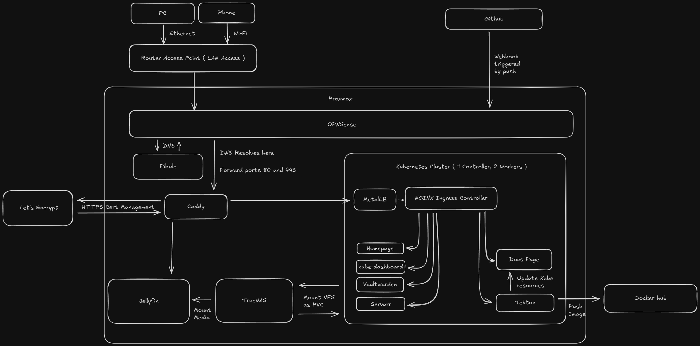

# Index

Hello, World! This is a living document explaining the technologies and tools used to build my home server.

## Technologies

- [Proxmox](proxmox.md)
- [OPNSense](opnsense.md)
- [Kubernetes](kubernetes.md)
- [Pihole + Unbound](pihole.md)
- [Caddy](caddy.md)
- [Truenas](truenas.md)
- [Terraform](terraform.md)
- [Vaultwarden](vaultwarden.md)
- [Servarr](servarr.md)
- [Homepage](homepage.md)
- [Tekton](tekton.md)
- [Docs](docs.md)

## Diagram

