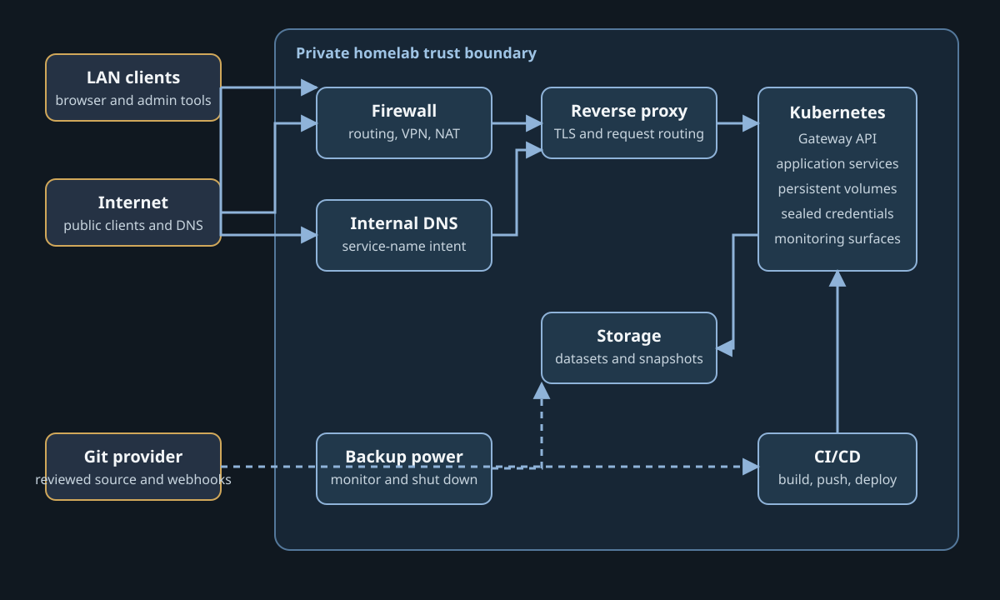

# Index

This guide explains reusable technologies, design choices, and operating patterns for a self-hosted home server. Examples are intentionally generalized and do not represent a live deployment inventory.

## Technologies

- [Proxmox](proxmox.md)
- [OPNSense](opnsense.md)
- [Kubernetes](kubernetes.md)
- [Pihole + Unbound](pihole.md)
- [Caddy](caddy.md)
- [Truenas](truenas.md)
- [Terraform](terraform.md)
- [Vaultwarden](vaultwarden.md)
- [Servarr](servarr.md)
- [Homepage](homepage.md)
- [Tekton](tekton.md)
- [NUT](nut.md)
- [Docs](docs.md)

## Diagram

The diagram shows roles and trust boundaries. Component count, addresses, names, and capacity should be adapted to each environment.
